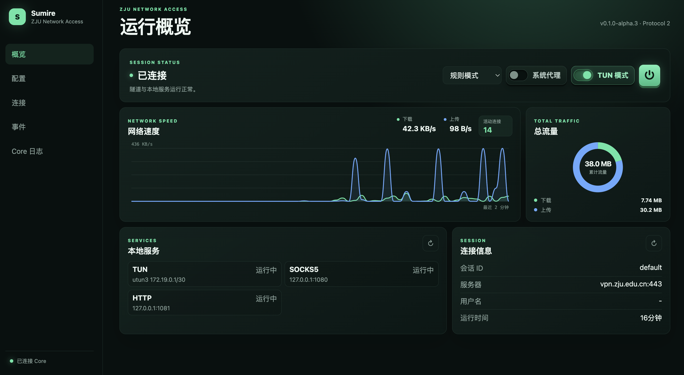

<h1 align="center">Sumire</h1>

<h3 align="center">面向 ZJU 网络访问的轻量客户端</h3>

<p align="center">
  <a href="https://github.com/Eclipsky1337/sumire/actions/workflows/ci.yml"></a>
  <a href="https://github.com/Eclipsky1337/sumire/releases"></a>
</p>

## Features

- REST Token 连接与协议版本检查；
- Session 启停、状态和路由模式切换；
- 完整守护进程配置查看、修改与文件重载；
- SSE 认证 challenge（密码、短信、TOTP、CAS/OAuth、图形验证码点击和认证方式选择）；
- 流量、服务、逻辑连接和实时事件展示。
- 托管 Core 的 stdout/stderr 实时日志查看。

## Demo



## Quick Start

### 托管模式（推荐）

Release 压缩包中将 WebUI 和 Core 放在同一目录：

```text
sumire/
├── sumire
└── zju-portal-core
```

直接运行 WebUI 即可：

```bash
./sumire
```

WebUI 会自动发现同目录的 `zju-portal-core`（Windows 为 `zju-portal-core.exe`），Core 随 WebUI 自动启动并在异常退出后自动重启。托管数据默认保存在 WebUI 同目录的 `data` 文件夹。

每个 Sumire Release 会自动打包发布时最新的 `zju-portal-core` Release。

托管模式默认使用：

- `data/config.yaml`：Core 配置；
- `data/resume-state.json`：Resume State；
- `data/control.token`：REST Token；
- `127.0.0.1:9090`：Core REST 地址。

### 外部模式

也可以继续连接手动启动的 Core：

```bash
./sumire -external-core -listen 127.0.0.1:9080 -core http://127.0.0.1:9090
```
